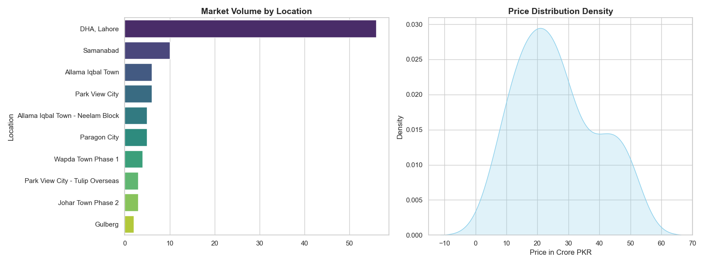

# Task 3: Data Visualization - Lahore Market Insights

## 📌 Overview
The final stage of this project involves creating high-impact visual representations of the cleaned real estate data. Using Python's visualization libraries, we transform raw statistics into actionable market insights.

## 🛠️ Visualization Strategy
I utilized **Matplotlib** and **Seaborn** to create a dual-pane dashboard that captures both the "Where" and the "How Much" of the Lahore property market.

### 1. Market Volume by Location (Bar Chart)
- **What it shows:** A ranking of the top locations based on listing frequency.
- **Insight:** **DHA, Lahore** dominates the digital landscape, accounting for over 30% of the total market activity. This indicates that DHA is the primary focus for online real estate engagement.

### 2. Price Distribution (Histogram with KDE)
- **What it shows:** The density of property prices across the 174 scraped listings.
- **Insight:** The "Peak" of the distribution sits between **20 Crore and 30 Crore PKR**. The inclusion of a Kernel Density Estimate (KDE) line helps visualize the "smooth" flow of the market, confirming that most luxury listings are clustered around the 25 Crore mark.

## 📊 Key Findings from Visuals
- **High Standardization:** The price distribution is relatively "Normal," meaning prices are consistent across the most popular areas.
- **Investment Hotspots:** Outside of DHA, areas like **Samanabad** and **Allama Iqbal Town** show emerging activity, though they currently trail significantly in total volume.
- **Price Ceiling:** The chart clearly shows the market thinning out as we approach the 50 Crore PKR mark, identifying the "Ultra-Luxury" threshold.

## 🖼️ Final Deliverable
The following image was exported directly from the `visualise.py` script:

## 📄 Files in this Task
- `visualise.py`: The Python script using Seaborn and Matplotlib.
- `Lahore_Market_Analysis.png`: The final exported visual report.